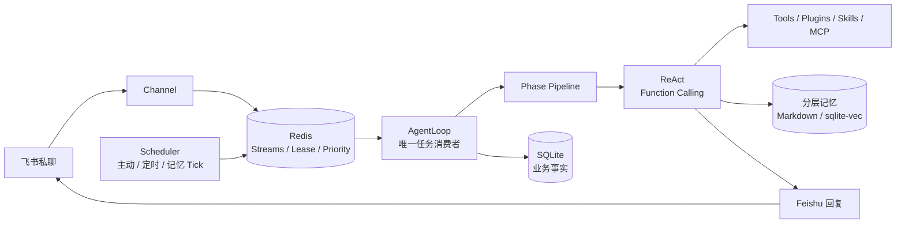

<div align="center">

# MemoPilot

### 会记忆、会判断，也会主动行动的个人 AI Agent

一个面向 AI 后端与 Agent 工程实践的 Python 项目：以可追踪的 ReAct Runtime 为核心，把长期记忆、主动信息筛选、定时任务和工具扩展组织成职责清晰的执行链路。

<p>
  <a href="#核心能力">核心能力</a> ·
  <a href="#快速开始">快速开始</a> ·
  <a href="#系统架构">系统架构</a> ·
  <a href="#开发与验证">开发与验证</a>
</p>


</div>

> MemoPilot 的重点不是“把模型接进聊天框”，而是让对话、记忆、主动任务和工具调用形成职责清晰、可观察的 Agent 系统。

## 项目简介

传统聊天式 AI 通常只在用户提问后响应，缺少稳定的长期上下文，也很难在合适的时间主动完成任务。MemoPilot 将个人助理拆解为几个清晰的后端边界：

- **理解问题**：外层 Phase Pipeline 管理上下文、记忆、推理和响应阶段；内层 ReAct 循环负责逐步决定是否调用工具。
- **记住重要信息**：短期对话、Markdown 长期记忆和 SQLite 向量记忆分层保存，检索使用向量、关键词和 RRF 融合。
- **主动发现内容**：Scheduler 周期性触发主动链路，由 MCP Source 获取 Alert、Content 和 Context，再由同一个 Agent Runtime 判断是否值得打扰用户。
- **可靠地执行**：SQLite 保存会话、记忆、定时与主动决策等业务事实；Redis 负责后台任务、优先级、Lease 和用户抢占；主动决策、ACK 与定时执行状态用于避免重复处理。
- **保持可扩展**：工具、Prompt、PhaseModule、Event Handler、Tool Hook、Skills 和 MCP stdio Server 均可在不改核心循环的情况下扩展能力。

## 核心能力

| 模块 | 作用 |
| --- | --- |
| Agent Runtime | 可追踪的 Phase Pipeline + ReAct / Function Calling，工具异常作为 Observation 交回模型判断 |
| 分层记忆 | 短期会话、`MEMORY.md` / `SELF.md` 等 Markdown 记忆、SQLite + sqlite-vec 向量记忆 |
| 主动链路 | 固定 Tick、MCP Source、Alert / Content / Context 分类、内容去重与 ACK |
| 任务调度 | `at`、`after`、`every` 三种触发方式，支持固定消息和 Agent 任务两种执行模式 |
| 任务协调 | Redis Streams、P0～P3 优先级、Lease / Fencing、用户消息抢占与 Pending 接管 |
| 扩展机制 | `@tool`、`@on_tool_pre`、Event Handler、PhaseModule、Skills、MCP stdio |
| 飞书接入 | 飞书私聊长连接、流式思考卡片、工具过程展示和最终消息独立投递 |

### 已迁移的内置插件

当前内置运行时插件包括 `tool_loop_guard`、`context_pressure`、`citation`、`observe`、`status_commands`、`setup_helper`、`meme` 和 `plugin_undo`。它们沿用统一 Phase Pipeline、EventBus 和 MessagePush 链路，不建立插件专用执行旁路。

| 命令 | 作用 |
| --- | --- |
| `/memorystatus` | 查看当前会话的记忆整理游标、消息数和待整理用户消息数 |
| `/kvcache [N]` | 查看最近 N 轮真实 Prompt Cache 使用情况 |
| `/chatid` 或 `/myid` | 查看当前 `channel` 和 `chat_id`；私聊目标会自动登记 |
| `/undo` | 原子删除当前会话最近一轮完整对话并回退整理游标 |

`/undo` 不撤回渠道上已经发送的历史消息，也不回滚已提炼进长期记忆的数据：当前 Schema 无法把已提炼记忆可靠关联回单轮消息，命令回复会明确提示这一限制。

表情资源位于运行时工作区的 `memes/`：用 `memes/manifest.json` 声明启用分类，并将图片放入同名分类子目录。缺少 manifest 或可用图片时插件静默不发送媒体。

被动回复的 assistant 媒体集合由 `operational_v9` 持久化到 `messages.media_json`；Redis Pending 重放会恢复同一媒体集合，持久化 JSON 损坏时明确失败且不 ACK，避免静默丢图。

## 系统架构



系统在一个 Python 进程中运行四个异步协作单元：

| 异步单元 | 职责 |
| --- | --- |
| `Channel` 协程 | 维护飞书长连接，把私聊消息作为 P0 任务原子发布到 Redis |
| `AgentLoop` 协程 | 统一消费被动、主动、定时、Drift 和记忆任务，共用 Lease、Fencing 与 Pending 接管 |
| `Scheduler` 协程 | 生成主动 Tick、扫描定时任务并向 Redis 发布轻量后台任务 |

用户消息以 P0 进入统一队列，并在同一次 Redis Lua 调用中登记稳定任务 ID 与后台停止信号。定时任务、主动检查和记忆维护使用 P1～P3；所有路径共享会话 Lease。

## 一次对话如何运行

```text
飞书事件
  │
  ├─ Redis：原子发布 P0 与抢占信号
  ├─ AgentLoop：统一获取 Lease 并执行被动 Turn
  ├─ Phase Pipeline：准备上下文 → ReAct → 响应后处理
  ├─ ReAct：检索记忆 / 调用工具 / 处理 Observation
  ├─ MessagePushTool：明确发送最终回复
  ├─ SQLite：保存最终对话
  └─ Redis 后台任务：Consolidation / Post-response / 向量写入
```

工具失败不会直接让整个 Agent Turn 崩溃：Runtime 会把结构化错误交回模型，由模型决定修正参数、重试、换工具或向用户解释失败。只有启动配置错误、失权和无法恢复的基础设施错误才会提前终止执行。

## 快速开始

### 1. 准备环境

要求：

- Python 3.12
- [uv](https://docs.astral.sh/uv/)
- Redis 7.2 或更高版本（`main.py` 会复用已有服务，未运行时自动启动本机 Redis）

```bash
git clone https://github.com/CR-730/MemoPilot.git
cd MemoPilot
uv sync --all-groups
```

### 2. 配置模型和飞书

复制示例配置：

```bash
cp .env.example .env
```

运行时唯一的主配置文件是项目根目录的 `config.toml`。`.env` 只用于提供 `MEMOPILOT_*` 密钥或未写入 TOML 的环境变量，不承担另一套业务配置；也可以在 `config.toml` 中使用 `${变量名}` 引用环境变量。

至少需要填写以下配置：

```dotenv
MEMOPILOT_CHAT_API_KEY=你的模型密钥
MEMOPILOT_CHAT_MULTIMODAL=false
MEMOPILOT_FAST_MODEL=轻量任务模型
MEMOPILOT_FAST_API_KEY=轻量任务模型密钥
MEMOPILOT_VL_MODEL=视觉模型
MEMOPILOT_VL_API_KEY=视觉模型密钥
MEMOPILOT_EMBEDDING_BASE_URL=https://dashscope.aliyuncs.com/compatible-mode/v1
MEMOPILOT_EMBEDDING_MODEL=text-embedding-v2
MEMOPILOT_EMBEDDING_API_KEY=你的向量模型密钥
MEMOPILOT_EMBEDDING_DIMENSION=1536
MEMOPILOT_FEISHU_APP_ID=你的飞书应用 ID
MEMOPILOT_FEISHU_APP_SECRET=你的飞书应用 Secret
MEMOPILOT_FEISHU_ALLOW_FROM=["允许的 open_id"]
```

密钥只放在本地 `.env` 或外部配置文件中，不要提交到 Git。三个对话 Provider 均使用 OpenAI-compatible 接口：`main` 执行 Agent、主动判断和长期记忆提取；`fast` 执行 Recent Context、PostResponse、记忆假设查询和 Procedure Tagger，未配置时自动回退到 `main`；主模型不支持图片时，`vl` 提供 `read_image_vision` 工具。

也可以直接在 `config.toml` 中配置 `[llm.main]`、`[llm.fast]` 和 `[llm.vl]`。当 `llm.main.multimodal = true` 时，图片直接进入主模型，不注册独立 VL 工具。

### 3. 配置 MCP

MCP 第一版使用 stdio。运行时工作区默认位于 `~/.memopilot/memopilot-workspace`；将服务器定义放在其中的 `mcp_servers.json`，主动信息源映射放在其中的 `proactive_sources.json`。MCP 环境变量使用 `${变量名}` 引用，不要把真实密钥写进 JSON。

### 4. 启动 MemoPilot

一个命令即可启动 `AppRuntime`。其中的 Channel、AgentLoop 和 SchedulerService 在同一个 `asyncio` 事件循环中协作：

```bash
uv run python main.py
```

启动入口会先检查配置中的 Redis。对于本机地址，它会优先复用已有服务；连接失败时自动查找并启动 `redis-server`，退出时只关闭本次启动的子进程。可以通过 `MEMOPILOT_REDIS_SERVER` 指定可执行文件路径。远程 Redis 只做连接检查，不会启动本地替代服务。

启动后当前终端会直接进入纯文本 CLI，不需要再启动第二个 CLI 进程。输入消息后，主进程会在同一个事件循环中处理并返回最终回复；输入 `exit` 退出。

也可以显式使用包入口：

```bash
uv run memopilot run --config config.toml --workspace D:/path/to/workspace
```

请直接填写 MemoPilot 根目录现有的 `config.toml`，不要覆盖复制其他项目的完整配置文件。只迁移当前配置模板中真实存在的同名字段；未出现在模板中的旧频道、旧 Provider 或旧主动链路字段不会生效。

## 记忆系统

```text
当前 Turn
   ├─ 短期消息窗口：控制本轮上下文
   ├─ Markdown 长期记忆：MEMORY / SELF / HISTORY / PENDING / RECENT_CONTEXT
   └─ SQLite 向量记忆：event / profile / preference / procedure
                         └─ 向量 + 关键词 + RRF + hotness
```

- 自动预检索在第一次模型推理前注入上下文；`recall_memory` 由模型在 ReAct 中按需调用。
- 短期历史和 Consolidation 统一由 `memory_window` 派生：默认值 40 对应 20 条热历史、保留 20 条、最少整理 10 条、Recent Turns 10 条；非 4 的倍数先向上对齐。
- assistant 的历史工具调用会与 Observation 一同持久化并在下一轮恢复；单条工具结果超过 10,000 字符时保留首尾并标注截断。
- 默认使用原始 Query，不开启 HyDE；`timeline`、`interest`、`procedure` 等意图拥有独立检索路径。
- Consolidation 负责从已完成对话中提取长期记忆和近期上下文；Post-response 负责处理用户后续纠正。
- 向量写入使用稳定 `source_ref` 与内容哈希幂等，旧事实不会被静默覆盖。

## 开发与验证

运行完整测试：

```bash
uv run pytest -q
```

运行代码质量检查：

```bash
uv run ruff check .
uv run mypy
```

真实模型和飞书测试会产生外部调用或费用。默认测试使用 Fake Provider、Fake Feishu 和本地测试数据；只有明确授权后才进行真实 API 验证。

## 项目结构

```text
MemoPilot/
├── src/memopilot/          # Agent、记忆、调度、主动链路和渠道实现
├── tests/                  # 单元、集成和恢复场景测试
├── scripts/                # 本地启动与受控冒烟脚本
├── .env.example            # 环境变量示例
├── pyproject.toml          # 依赖与工程配置
└── uv.lock                 # 可复现依赖锁定
```

## 设计边界

- 第一版只支持飞书私聊，不引入多渠道和独立 Dashboard。
- 全部运行模块默认由 `AppRuntime` 在一个异步进程中管理；Redis 负责后台任务优先级、会话互斥、用户抢占和异常恢复。
- 核心编排保持显式可追踪，不使用 LangChain 或 LangGraph 替代 Agent Loop。
- SQLite 是持久化事实源；Redis 负责队列、优先级、Lease 和运行时协调。
- 外部 MCP 只通过 stdio 接入；工具、插件和 Skills 仍受统一审计与权限边界约束。
