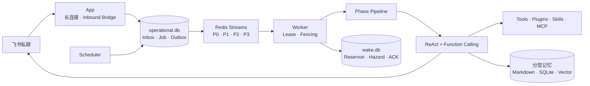

<div align="center">

# MemoPilot

### 会记得、会判断，也会主动行动的个人 AI Agent

基于 ReAct + Function Calling 构建可追踪的 Agent Runtime，融合分层长期记忆、主动唤醒、定时任务、插件、Skills 与 MCP。

[](https://www.python.org/)
[](#开发路线)
[](https://modelcontextprotocol.io/)
[](#项目边界)


</div>

> [!IMPORTANT]
> MemoPilot 当前处于工程初始化阶段，系统设计已经完成，核心 Runtime 正在按路线图持续开发。

## 为什么做 MemoPilot

传统对话式 AI 往往只能等待提问：它不了解长期关系，也很难在合适的时间主动完成任务。MemoPilot 尝试把个人助理拆成一组可理解、可测试、可恢复的后端能力：

- **不只回复**：周期性感知外部事件，判断是否值得主动联系用户。
- **不只记日志**：区分近期上下文、可读长期记忆和可检索向量记忆。
- **不依赖黑盒编排**：自主实现外层 Phase Pipeline 与内层 ReAct 循环。
- **不牺牲可靠性**：用 Redis 协调优先级和抢占，用 SQLite 保存事实与恢复意图。

## 核心能力

| 能力 | 设计重点 |
|---|---|
| Agent Runtime | 外层 Phase DAG + 内层 ReAct / Function Calling，每一步均可追踪 |
| 分层记忆 | 短期消息、Markdown 长期记忆、SQLite + sqlite-vec 向量检索 |
| 主动唤醒 | `alert / context / content` 事件流、Reservoir、可解释 Hazard、LLM 最终决策 |
| 定时任务 | 支持 `at / after / every` 与 `instant / agent` 两种执行模式 |
| 扩展机制 | Python 插件、PromptBlock、ToolHook、Skills 与 MCP stdio |
| 任务协调 | Redis Streams P0–P3、会话租约、持久化 fencing epoch 与用户消息抢占 |
| 可靠副作用 | Transactional Outbox、稳定 operation ID、飞书 UUID 幂等与不明确状态核对 |
| 可观测性 | Diagnostic Log、Strategy Trace 与只读 Inspector API，不开发独立 Dashboard |

## 系统架构



### 一条消息如何执行

1. 飞书长连接接收私聊事件，Inbox 去重并递增用户活动版本。
2. 同一 SQLite 事务创建 P0 Job 与 Outbox，随后至少一次发布到 Redis。
3. Worker 获取会话 Lease 和单调 Fencing Epoch，运行 Phase Pipeline。
4. ReAct 循环按需检索记忆、调用工具，并把失败作为 Observation 交回模型。
5. 最终发送前以数据库 CAS 校验用户活动版本，避免主动消息插入正在进行的聊天。
6. Turn 提交后异步执行 Consolidation、Markdown 归档与向量记忆写入。

## 记忆系统

```text
当前对话
   │
   ├── 短期消息窗口 ──────────────── 当前 Turn 的直接上下文
   ├── Markdown 长期记忆 ─────────── MEMORY / SELF / HISTORY / PENDING
   └── SQLite 向量记忆 ───────────── event / profile / preference / procedure
                                         │
                              Vector + Keyword + RRF
```

自动预检索与 `recall_memory` 复用同一 Retriever，但承担不同职责：前者在普通 Turn 前用原始问题获取上下文，默认不开启 HyDE；后者是模型按需调用的工具，`answer` 路径会使用双假设查询增强证据召回。

## 项目边界

- 单所有者、自托管，不做 SaaS 多租户。
- 第一版只支持飞书机器人私聊，不做多渠道。
- Chat Provider 使用统一 OpenAI-compatible 接口，首个验证模型为 DeepSeek。
- MCP 第一版只支持 stdio，外部 MCP Server 不并入本仓库。
- 不使用 LangChain、LangGraph 编排核心 Agent Loop。
- 不开发 Dashboard；通过 FastAPI `/docs` 查询 Inspector 数据。
- 不引入 PostgreSQL；第一版使用 SQLite、Markdown 与 Redis。

## 开发环境

项目使用 Python 3.12 与 [uv](https://docs.astral.sh/uv/) 管理环境。阶段 1 的集成测试还需要本机 Redis 7.2 或更高版本监听 `127.0.0.1:6379`；Python 依赖仍全部由 `uv` 隔离管理，不要求使用 Docker 开发。

```bash
git clone https://github.com/CR-730/MemoPilot.git
cd MemoPilot
uv sync --all-groups
uv run pytest
```

当前命令只验证工程基线。Agent 启动命令将在 App、Worker 与 Scheduler 完成后加入。

### 配置

复制示例配置并填写自己的密钥：

```bash
cp .env.example .env
```

对话模型与 Embedding Provider 独立配置。任何 API Key、飞书 Secret、用户数据、SQLite 数据库和上传文件都不会进入 Git。

非敏感默认值位于 `config/default.yaml`，实际优先级为环境变量 > `.env` > YAML 默认值。启动核心服务前会一次性检查模型、Embedding、飞书 owner 白名单和 workspace 路径；已有向量库还会校验 Provider、模型与向量维度，避免静默混用不兼容向量。

## 开发路线

- [x] 完成系统设计、可靠性评审与两周范围划分
- [x] 创建项目仓库、Python 包和工程基线
- [x] 建立三库迁移、Transactional Inbox / Outbox 与 Redis 任务底座
- [ ] 实现 Phase Pipeline、ReAct Runtime 与统一工具执行
- [ ] 接入飞书私聊和可靠外发状态机
- [ ] 实现分层检索、Consolidation 与 Memory Optimizer
- [ ] 接入插件、Skills、MCP、主动唤醒与定时任务
- [ ] 完成 Inspector、Docker Compose、故障测试和演示脚本


## 仓库结构

```text
MemoPilot/
├── src/memopilot/     # Agent 核心代码
├── tests/             # 单元、集成、回放与 E2E 测试
├── config/             # 不含 Secret 的 YAML 默认配置
├── .env.example       # 无 Secret 的配置示例
└── pyproject.toml     # 依赖与工程工具配置
```

## 提交约定

提交信息使用中文 Conventional Commits，保证历史既真实又便于阅读：

```text
feat: 实现会话级任务租约
fix: 修复主动消息抢占竞态
test: 增加 Redis 清空恢复测试
docs: 完善分层记忆设计说明
```
