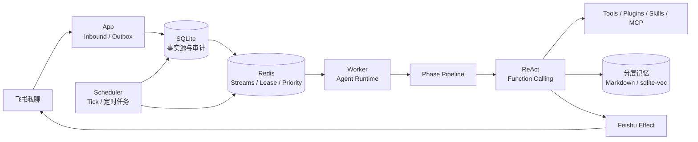

<div align="center">

# MemoPilot

### 会记忆、会判断，也会主动行动的个人 AI Agent

一个面向 AI 后端与 Agent 工程实践的 Python 项目：以可追踪的 ReAct Runtime 为核心，把长期记忆、主动信息筛选、定时任务和工具扩展组织成一条可恢复的执行链路。

<p>
  <a href="#核心能力">核心能力</a> ·
  <a href="#快速开始">快速开始</a> ·
  <a href="#系统架构">系统架构</a> ·
  <a href="#开发与验证">开发与验证</a>
</p>


</div>

> MemoPilot 的重点不是“把模型接进聊天框”，而是把一次 Agent Turn 变成可观察、可审计、可恢复的后端执行过程。

## 项目简介

传统聊天式 AI 通常只在用户提问后响应，缺少稳定的长期上下文，也很难在合适的时间主动完成任务。MemoPilot 将个人助理拆解为几个清晰的后端边界：

- **理解问题**：外层 Phase Pipeline 管理上下文、记忆、推理和响应阶段；内层 ReAct 循环负责逐步决定是否调用工具。
- **记住重要信息**：短期对话、Markdown 长期记忆和 SQLite 向量记忆分层保存，检索使用向量、关键词和 RRF 融合。
- **主动发现内容**：Scheduler 周期性触发主动链路，由 MCP Source 获取 Alert、Content 和 Context，再由同一个 Agent Runtime 判断是否值得打扰用户。
- **可靠地执行**：SQLite 保存事实与审计记录，Redis 负责排队、优先级、Lease 和跨进程协调；外部发送使用 Outbox 与幂等键避免重复副作用。
- **保持可扩展**：工具、Prompt、PhaseModule、Event Handler、Tool Hook、Skills 和 MCP stdio Server 均可在不改核心循环的情况下扩展能力。

## 核心能力

| 模块 | 作用 |
| --- | --- |
| Agent Runtime | 可追踪的 Phase Pipeline + ReAct / Function Calling，工具异常作为 Observation 交回模型判断 |
| 分层记忆 | 短期会话、`MEMORY.md` / `SELF.md` 等 Markdown 记忆、SQLite + sqlite-vec 向量记忆 |
| 主动链路 | 固定 Tick、MCP Source、Alert / Content / Context 分类、内容去重与 ACK |
| 任务调度 | `at`、`after`、`every` 三种触发方式，支持固定消息和 Agent 任务两种执行模式 |
| 可靠投递 | SQLite 事实源、Transactional Outbox、Redis Streams、Lease / Fencing、Effect 记录 |
| 扩展机制 | `@tool`、`@on_tool_pre`、Event Handler、PhaseModule、Skills、MCP stdio |
| 飞书接入 | 飞书私聊长连接、流式思考卡片、工具过程展示和最终消息独立投递 |

## 系统架构



系统默认拆成三个常驻进程：

| 进程 | 职责 |
| --- | --- |
| `App` | 接收飞书私聊事件、写入 Inbox、创建用户消息 Job，并负责外发 Outbox |
| `Scheduler` | 生成固定 Tick、扫描用户定时任务、提交记忆维护任务 |
| `Worker` | 获取会话 Lease，执行 Agent Runtime、工具调用、记忆检索和最终回复 |

用户消息使用 P0 优先级；主动内容使用 P2；后台 Drift 使用 P3。它们共享同一个会话 Lease，因此主动消息不会插入正在进行的用户回复。

## 一次对话如何运行

```text
飞书事件
  │
  ├─ SQLite 事务：Inbox + AgentJob + Outbox
  ├─ Redis：发布可恢复的执行副本
  ├─ Worker：Lease + Fencing 校验
  ├─ Phase Pipeline：准备上下文 → ReAct → 响应后处理
  ├─ ReAct：检索记忆 / 调用工具 / 处理 Observation
  ├─ Effect：幂等地发送最终消息
  └─ 异步任务：Consolidation / Post-response / 向量写入
```

工具失败不会直接让整个 Agent Turn 崩溃：Runtime 会把结构化错误交回模型，由模型决定修正参数、重试、换工具或向用户解释失败。只有启动配置错误、失权和无法恢复的基础设施错误才会提前终止执行。

## 快速开始

### 1. 准备环境

要求：

- Python 3.12
- [uv](https://docs.astral.sh/uv/)
- Redis 7.2 或更高版本（运行并发任务链路时需要）

```bash
git clone https://github.com/CR-730/MemoPilot.git
cd MemoPilot
uv sync --all-groups
```

### 2. 配置模型和飞书

复制示例配置：

```bash
cp .env.example .env
```

至少需要填写以下配置：

```dotenv
MEMOPILOT_CHAT_API_KEY=你的模型密钥
MEMOPILOT_EMBEDDING_BASE_URL=https://dashscope.aliyuncs.com/compatible-mode/v1
MEMOPILOT_EMBEDDING_MODEL=text-embedding-v2
MEMOPILOT_EMBEDDING_API_KEY=你的向量模型密钥
MEMOPILOT_EMBEDDING_DIMENSION=1536
MEMOPILOT_FEISHU_APP_ID=你的飞书应用 ID
MEMOPILOT_FEISHU_APP_SECRET=你的飞书应用 Secret
MEMOPILOT_FEISHU_ALLOW_FROM=["允许的 open_id"]
```

密钥只放在本地 `.env` 或外部配置文件中，不要提交到 Git。默认聊天 Provider 使用 OpenAI-compatible 接口，可通过 `MEMOPILOT_CHAT_BASE_URL` 和 `MEMOPILOT_CHAT_MODEL` 切换模型。

### 3. 配置 MCP

MCP 第一版使用 stdio。将服务器定义放在 `workspace/mcp_servers.json`，主动信息源映射放在 `workspace/proactive_sources.json`。MCP 环境变量使用 `${变量名}` 引用，不要把真实密钥写进 JSON。

### 4. 启动三个进程

分别打开三个终端：

```bash
uv run memopilot app --config config.toml --workspace workspace
uv run memopilot scheduler --config config.toml --workspace workspace
uv run memopilot worker --config config.toml --workspace workspace
```

如果使用旧原型中的本地配置，可通过仓库提供的桥接脚本启动；脚本只在当前进程中读取密钥，不会复制到仓库：

```powershell
powershell -ExecutionPolicy Bypass -File .\scripts\run_with_prototype_config.ps1 worker
```

## 记忆系统

```text
当前 Turn
   ├─ 短期消息窗口：控制本轮上下文
   ├─ Markdown 长期记忆：MEMORY / SELF / HISTORY / PENDING / RECENT_CONTEXT
   └─ SQLite 向量记忆：event / profile / preference / procedure
                         └─ 向量 + 关键词 + RRF + hotness
```

- 自动预检索在第一次模型推理前注入上下文；`recall_memory` 由模型在 ReAct 中按需调用。
- 默认使用原始 Query，不开启 HyDE；`timeline`、`interest`、`procedure` 等意图拥有独立检索路径。
- Consolidation 负责从已完成对话中提取长期记忆和近期上下文；Post-response 负责处理用户后续纠正。
- 向量写入使用稳定 `source_ref` 与内容哈希幂等，旧事实不会被静默覆盖。

## 开发与验证

运行完整测试：

```bash
uv run pytest -q
```

运行代码质量检查：

```bash
uv run ruff check .
uv run mypy
```

运行单次 Effect 核对：

```bash
uv run memopilot effects list --config config.toml --workspace workspace
uv run memopilot effects show <operation_id> --config config.toml --workspace workspace
```

真实模型和飞书测试会产生外部调用或费用。默认测试使用 Fake Provider、Fake Feishu 和本地测试数据；只有明确授权后才进行真实 API 验证。

## 项目结构

```text
MemoPilot/
├── src/memopilot/          # Agent、记忆、调度、主动链路和渠道实现
├── tests/                  # 单元、集成和恢复场景测试
├── config/default.yaml     # 不含密钥的默认配置
├── scripts/                # 本地启动与受控冒烟脚本
├── .env.example            # 环境变量示例
├── pyproject.toml          # 依赖与工程配置
└── uv.lock                 # 可复现依赖锁定
```

## 设计边界

- 第一版只支持飞书私聊，不引入多渠道和独立 Dashboard。
- 核心编排保持显式可追踪，不使用 LangChain 或 LangGraph 替代 Agent Loop。
- SQLite 是持久化事实源；Redis 负责队列、优先级、Lease 和运行时协调。
- 外部 MCP 只通过 stdio 接入；工具、插件和 Skills 仍受统一审计与权限边界约束。
