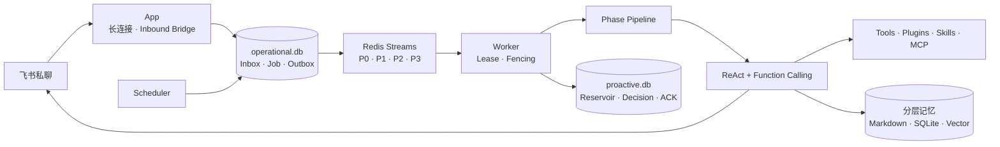

<div align="center">

# MemoPilot

### 会记得、会判断，也会主动行动的个人 AI Agent

基于 ReAct + Function Calling 构建可追踪的 Agent Runtime，融合分层长期记忆、主动唤醒、定时任务、插件、Skills 与 MCP。

[](https://www.python.org/)
[](https://modelcontextprotocol.io/)
[](#项目边界)

</div>

## 为什么做 MemoPilot

传统对话式 AI 往往只能等待提问：它不了解长期关系，也很难在合适的时间主动完成任务。MemoPilot 尝试把个人助理拆成一组可理解、可测试、可恢复的后端能力：

- **不只回复**：周期性感知外部事件，判断是否值得主动联系用户。
- **不只记日志**：区分近期上下文、可读长期记忆和可检索向量记忆。
- **不依赖黑盒编排**：自主实现外层 Phase Pipeline 与内层 ReAct 循环。
- **不牺牲可靠性**：用 Redis 协调优先级和抢占，用 SQLite 保存事实与恢复意图。

## 核心能力

| 能力 | 设计重点 |
|---|---|
| Agent Runtime | 外层 Phase DAG + 内层 ReAct / Function Calling，每一步均可追踪 |
| 分层记忆 | 短期消息、Markdown 长期记忆、SQLite + sqlite-vec 向量检索 |
| 主动唤醒 | `Alert > Content > Context-fallback` 的统一 AgentTick、Reservoir 与 Drift |
| 定时任务 | 支持 `at / after / every` 与 `instant / agent` 两种执行模式 |
| 扩展机制 | Python 插件、PromptBlock、ToolHook、Skills 与 MCP stdio |
| 任务协调 | Redis Streams P0–P3、会话租约、持久化 fencing epoch 与用户消息抢占 |
| 可靠副作用 | Transactional Outbox、稳定 operation ID、飞书 UUID 幂等与不明确状态核对 |
| 飞书私聊 | 长连接入站、实时思考/工具过程卡、终态折叠与独立可靠最终回复 |
| 可观测性 | Diagnostic Log、Strategy Trace 与只读 Inspector API，不开发独立 Dashboard |

## 系统架构



### 一条消息如何执行

1. 飞书长连接接收私聊事件，Inbox 去重并递增用户活动版本。
2. 同一 SQLite 事务创建 P0 Job 与 Outbox，随后至少一次发布到 Redis。
3. Worker 获取会话 Lease 和单调 Fencing Epoch，运行 Phase Pipeline。
4. ReAct 循环按需检索记忆、调用工具，并把失败作为 Observation 交回模型。
5. 最终发送前以数据库 CAS 校验用户活动版本，避免主动消息插入正在进行的聊天。
6. Turn 提交后异步执行 Consolidation、Markdown 归档与向量记忆写入。

## 记忆系统

```text
当前对话
   │
   ├── 短期消息窗口 ──────────────── 当前 Turn 的直接上下文
   ├── Markdown 长期记忆 ─────────── MEMORY / SELF / HISTORY / PENDING / RECENT_CONTEXT / JOURNAL
   └── SQLite 向量记忆 ───────────── event / profile / preference / procedure
                                         │
                              Vector + Keyword + RRF
```

自动预检索与 `recall_memory` 复用同一 Retriever，但承担不同职责：前者在普通 Turn 前用原始问题获取上下文，默认不开启 HyDE；后者是模型按需调用的工具，`answer` 路径会使用双假设查询增强证据召回。

## 项目边界

- 单所有者、自托管，不做 SaaS 多租户。
- 第一版只支持飞书机器人私聊，不做多渠道。
- Chat Provider 使用统一 OpenAI-compatible 接口，首个验证模型为 DeepSeek。
- MCP 第一版只支持 stdio，外部 MCP Server 不并入本仓库。
- 不使用 LangChain、LangGraph 编排核心 Agent Loop。
- 不开发 Dashboard；通过 FastAPI `/docs` 查询 Inspector 数据。
- 不引入 PostgreSQL；第一版使用 SQLite、Markdown 与 Redis。

## 开发环境

项目使用 Python 3.12 与 [uv](https://docs.astral.sh/uv/) 管理环境。Redis 集成测试需要本机 Redis 7.2 或更高版本监听 `127.0.0.1:6379`；Python 依赖仍全部由 `uv` 隔离管理，不要求使用 Docker 开发。

```bash
git clone https://github.com/CR-730/MemoPilot.git
cd MemoPilot
uv sync --all-groups
uv run pytest
```

当前自动化测试使用 Fake Provider 与 Fake Feishu，不需要模型 API Key，也不会产生外部副作用。

仓库还提供真实 DeepSeek 手动冒烟脚本。配置 `MEMOPILOT_CHAT_API_KEY` 后，它会要求模型调用一个无副作用的本地状态工具，再输出自然语言结果：

```bash
uv run python scripts/smoke_deepseek_runtime.py
```

默认模型为 `deepseek-v4-flash`，可通过 `MEMOPILOT_CHAT_MODEL` 覆盖；Provider 使用统一 OpenAI-compatible Chat Completions 接口。思考模式默认关闭，可通过 `MEMOPILOT_LLM_THINKING_ENABLED=true` 开启。开启后，DeepSeek Provider 会把 `reasoning_content` 收入不透明的 `provider_fields`，修补历史 assistant 消息并在后续请求中原样回传；通用 Provider 会剥离该字段，运行审计也不持久化思考正文。

飞书会使用 schema 2.0 交互卡片展示流式过程：生成期间更新模型返回的思考增量、工具调用状态和临时回复，结束后将思考折叠为过程卡，最终答案单独通过可靠外发状态机发送。未开启思考模式时不会生成思考正文；live 卡失败或限流只关闭过程预览，不改变最终任务结果。

### 配置

复制示例配置并填写自己的密钥：

```bash
cp .env.example .env
```

对话模型与 Embedding Provider 独立配置。任何 API Key、飞书 Secret、用户数据、SQLite 数据库和上传文件都不会进入 Git。

非敏感默认值位于 `config/default.yaml`，实际优先级为环境变量 > `.env` > YAML 默认值。启动核心服务前会一次性检查模型、Embedding、飞书 owner 白名单和 workspace 路径；已有向量库还会校验 Provider、模型与向量维度，避免静默混用不兼容向量。

主动唤醒默认关闭。启用时，在 `workspace/proactive_sources.json` 中把已经配置的 stdio MCP Server 映射为主动信息源；密钥仍只写环境变量引用：

```json
{
  "sources": [
    {
      "id": "personal-feed",
      "server": "feed",
      "channel": "content",
      "get_tool": "fetch_events",
      "ack_tool": "ack_event"
    }
  ]
}
```

固定 Tick 先并行采集 Alert、Content 与 Context，形成一份静态快照，再交给同一个 AgentTick ReAct 按 `Alert > Content > Context-fallback` 决策：同 Tick 的 Alert 合并发送；无 Alert 时逐条判断最多 5 条 Content；Context 只作为背景，或在策略明确放行时充当末级兜底。正文会提前并发抓取，但模型默认只看到元数据，需要时再通过工具读取。被引用、感兴趣但未引用、明确丢弃的内容分别以 168、24、720 小时 ACK；发送前还会执行来源级与语义级去重。没有可推送内容且超过最短间隔时，Drift 会把一个 P3 后台任务排入队列，由模型从可用 Skills 中选择任务并通过 ReAct 执行。

系统由三个可独立部署的常驻进程组成。App 只负责飞书入站，Scheduler 生成固定 Tick、用户定时任务和记忆维护 Job，Worker 按 P0–P3 优先级执行：

```bash
uv run memopilot app --config config.toml
uv run memopilot scheduler --config config.toml
uv run memopilot worker --config config.toml
```

`schedule` 工具支持 `at / after / every`；`instant` 到时直接发送固定文本，不调用模型，`agent` 到时重新运行 Agent。用户新消息会抢占正在执行的 Proactive/Drift；定时任务则原子延期并重新排队，避免为了及时回复而丢失任务。

## 仓库结构

```text
MemoPilot/
├── src/memopilot/     # Agent 核心代码
├── scripts/           # 手动冒烟与演示脚本
├── tests/             # 单元、集成、回放与 E2E 测试
├── config/            # 不含 Secret 的 YAML 默认配置
├── .env.example       # 无 Secret 的配置示例
└── pyproject.toml     # 依赖与工程工具配置
```

## 提交约定

提交信息使用中文 Conventional Commits，保证历史既真实又便于阅读：

```text
feat: 实现会话级任务租约
fix: 修复主动消息抢占竞态
test: 增加 Redis 清空恢复测试
docs: 完善分层记忆说明
```
